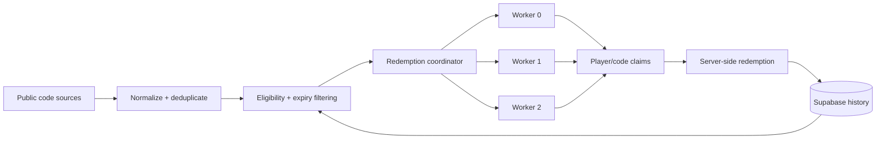

<div align="center">


# Kingshot Auto Redeemer

**Automated Kingshot gift-code discovery, redemption, and backfill.**

[](https://kingshot-autoredeemer.vercel.app/)
[](https://nodejs.org/)
[](https://react.dev/)
[](https://vite.dev/)
[](https://supabase.com/)
[](https://vercel.com/)
[](https://github.com/Judson-web/kingshot-auto-redeemer/actions/workflows/guardrails.yml)

[**Website →**](https://kingshot-autoredeemer.vercel.app/) · [**Developer API →**](https://kingshot-autoredeemer.vercel.app/developers.html) · [**How it works →**](https://kingshot-autoredeemer.vercel.app/info) · [**Issues →**](https://github.com/Judson-web/kingshot-auto-redeemer/issues)

</div>

> **Independent community service:** This project is not affiliated with, endorsed by, or operated by Century Games.

## Overview

Kingshot Auto Redeemer is a server-side automation service for eligible Kingshot gift codes. It supports continuous discovery, automatic redemption, manual redemption, and backfill for codes that were legitimately missed.

The same redemption core powers the public website and the Developer API, while privileged signing material remains server-side.

## What you can build

| Capability | Intended use |
|---|---|
| **Auto-redeem** | Periodically redeem eligible public gift codes for an authorized Player ID. |
| **Backfill** | Catch up on still-eligible codes missed while offline, before registration, or during an interruption. |
| **Bots & workers** | Run scheduled Discord bots, backend jobs, or community services. |
| **Manual redemption** | Submit a specific code directly from the website. |
| **Code discovery** | Normalize and deduplicate codes from configured public sources. |
| **Persistent history** | Prevent unnecessary duplicate processing and preserve redemption outcomes. |

## Developer API

Build server-side Kingshot integrations without implementing the upstream signing flow yourself.

**Base URL**

`https://kingshot-autoredeemer.vercel.app/api/v1`

### Endpoints

| Method | Endpoint | Auth | Description |
|---|---|---|---|
| GET | `/api/v1` | None | API metadata |
| GET | `/api/v1/health` | None | Service health |
| POST | `/api/v1/redeem` | Bearer key | Redeem an eligible gift code |

### Quick start

1. Create a verified developer account at the Developer Portal.
2. Create an API key and copy the secret once.
3. Store the key in your backend secret manager.
4. Call `POST /api/v1/redeem`.
5. Persist the returned request ID and redemption status.

```bash
curl -X POST https://kingshot-autoredeemer.vercel.app/api/v1/redeem \
  -H "Authorization: Bearer ks_live_YOUR_KEY" \
  -H "Content-Type: application/json" \
  -d '{"playerId":"123456789","kingdomId":"1125","code":"EXAMPLECODE"}'
```

### Request

| Field | Type | Rules |
|---|---|---|
| `playerId` | string | 4–32 digits |
| `kingdomId` | string | 1–8 digits |
| `code` | string | 3–64 characters: letters, numbers, `_`, `-` |

### Response

Successful responses include a stable status, human-readable label, message, and request ID.

```json
{
  "ok": true,
  "status": "SUCCESS",
  "statusLabel": "Redeemed",
  "message": "Gift code redeemed successfully.",
  "errCode": null,
  "requestId": "…"
}
```

### Automation and backfill

The API explicitly supports legitimate automation.

**Auto-redeem:** scheduled workers, Discord bots, community tools, and backend services may periodically discover eligible public codes and redeem them for authorized Player IDs.

**Backfill:** integrations may catch up on still-eligible codes missed while offline, before registration, or during a temporary interruption.

Both flows must use the normal API and remain subject to authentication, quotas, rate limits, cooldowns, eligibility checks, duplicate prevention, upstream restrictions, and reasonable retry/backoff.

Automation does not mean unlimited replay. Do not continuously retry expired, invalid, already-handled, or otherwise ineligible codes.

### Limits

| Limit | Default |
|---|---:|
| Active API keys / account | 3 |
| Requests / minute / key | 2 |
| Requests / day / key | 100 |

Limits may change as the service evolves. `429` responses include `Retry-After` where applicable.

### HTTP behavior

| Status | Meaning |
|---:|---|
| `400` | Invalid or malformed request |
| `401` | Missing, invalid, or inactive API key |
| `429` | Rate or daily quota exceeded |
| `5xx` | Temporary service/upstream failure |

Responses include request IDs for troubleshooting. Integrations should retry conservatively and respect server-provided limits.

### Security

API keys are generated using cryptographically secure randomness and only their SHA-256 hashes are stored. The full secret is shown once.

**Never:**

- put an API key in browser JavaScript or mobile client code;
- commit a key to Git;
- expose a key in logs or public repositories;
- share a key with untrusted users;
- rotate keys/accounts/IPs to bypass quotas;
- probe or overload the API or upstream services.

Use a server-side secret manager or protected environment variable.

## Automatic redemption architecture



Production coordination runs every minute. The current worker pool uses three durable shards, six concurrent player operations per worker, deterministic sharding, durable leases, atomic player/code claims, and persistent completion history.

## Redemption statuses

The redemption layer maps common upstream results into stable internal outcomes, including:

- `SUCCESS` — redemption completed.
- `RECEIVED` — already redeemed/received.
- `SAME TYPE EXCHANGE` — already handled for the relevant reward type.
- `TIME_ERROR` — code expired.
- `CDK_NOT_FOUND` — code invalid or unavailable.
- `USAGE_LIMIT` — code reached its usage limit.

Upstream rate-limit, login, and player errors may also be recorded.

## Acceptable use

Automation is permitted. Abuse is not.

Use only authorized Player IDs and legitimate public gift codes. Do not use the service or API to bypass quotas, evade authentication, flood requests, generate duplicate work intentionally, probe protected endpoints, harvest private data, manipulate redemption requests or results, or automate accounts/services without authorization.

Developer API integrations must not be used for credential theft, phishing, fraud, malware, harassment, denial-of-service activity, or reward abuse.

We may throttle, suspend, revoke, or block access when necessary to protect users, the service, or upstream systems.

See the [Developer API Terms](https://kingshot-autoredeemer.vercel.app/terms?service=developer-api) and [Privacy Policy](https://kingshot-autoredeemer.vercel.app/privacy?service=developer-api).

## Architecture and infrastructure

The application uses Vercel for deployment and Supabase/PostgreSQL for persistent state. Privileged operations, worker coordination, authentication, API key management, and redemption signing remain server-side.

The repository contains security regression checks, production smoke tests, worker health checks, API guardrails, and database privilege checks.

## Website

| Route | Purpose |
|---|---|
| `/` | Main service |
| `/auto` | Automatic redemption |
| `/manual` | Manual redemption |
| `/info` | Service documentation |
| `/developers.html` | Developer API portal |
| `/terms` | Terms |
| `/privacy` | Privacy |

## Local development

**Requirements:** Node.js 22.x and npm.

```bash
npm install
npm run dev
```

Production build:

```bash
npm run build
```

Preview:

```bash
npm run preview
```

## Environment

Production secrets are configured through the deployment environment and are never committed to the repository.

Do not commit:

- Supabase service-role or secret keys
- Kingshot API/signing secrets
- Discord credentials
- admin passwords
- session tokens
- Developer API keys

## Contributing

Changes involving redemption behavior, workers, database functions, authentication, API security, or public contracts are production-sensitive. Keep focused changes isolated, run the relevant regression checks, and never include credentials in commits.

## License

MIT — see [LICENSE](./LICENSE).
