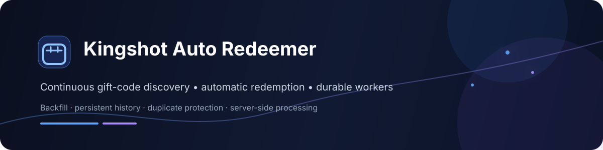

<div align="center">



# Kingshot Auto Redeemer

**Continuous Kingshot gift-code discovery and automatic redemption.**

[](https://kingshot-autoredeemer.vercel.app/)
[](https://nodejs.org/)
[](https://react.dev/)
[](https://vite.dev/)
[](https://supabase.com/)
[](https://vercel.com/)

[**Open the website →**](https://kingshot-autoredeemer.vercel.app/) · [**How it works →**](https://kingshot-autoredeemer.vercel.app/info) · [**Report an issue →**](https://github.com/Judson-web/NexAi-Neo/issues)

</div>

> **Independent community service:** Kingshot Auto Redeemer is not affiliated with, endorsed by, or operated by Century Games.

## Features
| | Capability | Description |
|---|---|---|
| ⚡ | **Auto Redeem** | Processes eligible gift codes automatically. |
| 🔄 | **Backfill** | Picks up active codes a player has not handled. |
| 🔎 | **Code Discovery** | Normalizes and deduplicates codes from configured public sources. |
| 🧾 | **Persistent History** | Stores player/code outcomes to avoid unnecessary repeats. |
| 🎟️ | **Manual Redeem** | Supports direct code submission from the website. |
| 🧩 | **Durable Workers** | Distributes registered players across three worker shards. |
| 🛡️ | **Server-side Processing** | Keeps privileged credentials and signing material out of the browser. |
| 🚦 | **Rate Limiting** | Protects public API surfaces from excessive requests. |
| 📡 | **Continuous Scheduler** | Production coordination runs every minute. |

## At a glance

```text
Register player
     ↓
Discover + normalize codes
     ↓
Filter expired / handled codes
     ↓
Distribute players across 3 workers
     ↓
Claim + redeem eligible codes
     ↓
Persist the result
```

## What it does

- **Automatic redemption** — registered players are processed automatically by the production worker system.
- **Backfill** — active codes that a player has not handled can be picked up after registration; backfill uses the same normal redemption flow rather than a separate one-time job.
- **Live code discovery** — public sources are collected, normalized, deduplicated, and filtered for known expired codes.
- **Persistent redemption history** — player/code results are stored so the same work is not repeatedly attempted.
- **Manual redemption** — users can submit a specific gift code when they want to redeem it themselves.
- **Durable worker pool** — registered players are deterministically distributed across three worker shards, with concurrent processing inside each worker.
- **Server-side redemption** — the actual game redemption request is made from the server, keeping signing material and privileged database credentials out of the browser.
- **Protected public endpoints** — registration and other public API surfaces use validation, rate limiting, and server-side checks.
- **Readable results** — game responses are mapped to statuses such as successful, already handled, expired, invalid, and rate limited.

## How automatic redemption works

The production flow is intentionally simple:

    Public code sources
            ↓
    Normalize + deduplicate + expiry filtering
            ↓
    Redemption coordinator
       ↙       ↓       ↘
    Worker 0  Worker 1  Worker 2
       ↘       ↓       ↙
    Player/code claims + redemption
            ↓
    Persistent redemption history

1. A player registers their Kingshot Player ID.
2. The service associates the registration with the player's current kingdom.
3. The scheduler invokes the redemption coordinator every minute.
4. Active gift codes are assembled from the configured public sources and expiry history.
5. The coordinator distributes registered players across three durable worker slots.
6. Each worker processes its assigned players concurrently.
7. A player is only given eligible codes they have not already handled.
8. The result is persisted, preventing duplicate work on later runs.

The worker pool is designed around durable claims and leases rather than relying on a single long-running process. Player and code claims are also protected so overlapping requests do not intentionally process the same work twice.

## Code discovery

The feed combines configured public sources, including the Kingshot public gift-code API/page and community code listings. Codes are normalized and deduplicated before entering the active pool.

Known expired codes are filtered using persisted redemption outcomes and source expiry information. A code receiving a game-level expiry response can therefore be excluded from future automatic processing.

## Redemption behavior

The service talks to the Kingshot gift-code endpoint from the server. Common game responses are translated into internal statuses, including:

- SUCCESS — redemption completed.
- RECEIVED — already redeemed/received.
- SAME TYPE EXCHANGE — already handled for the relevant reward type.
- TIME_ERROR — code has expired.
- CDK_NOT_FOUND — code is invalid or unavailable.
- USAGE_LIMIT — the code has reached its usage limit.
- Rate-limit and login/player errors are also recorded when returned by the upstream service.

Redemption history is per player and per code. This is separate from the global expired-code filter.

## Worker architecture

The application is deployed on Vercel with Supabase providing the persistent data layer.

The automatic redemption path currently uses:

- **3 durable worker shards**
- **6 concurrent player operations per worker**
- **18 theoretical simultaneous upstream attempts across the pool**
- deterministic player-to-worker sharding
- durable worker leases and completion records
- atomic player/code claims
- a minute-based production scheduler

The architecture is intentionally server-side: privileged Supabase operations and redemption signing credentials are never exposed to the public frontend.

## Website

**Live:** https://kingshot-autoredeemer.vercel.app/

The public site includes automatic redemption, manual redemption, service documentation, terms, and privacy pages.

## Website

**Production:** https://kingshot-autoredeemer.vercel.app/

| Route | Purpose |
|---|---|
| `/` | Main service experience |
| `/auto` | Automatic redemption |
| `/manual` | Manual redemption |
| `/info` | How the service works |
| `/terms` | Terms |
| `/privacy` | Privacy |

## Development

Requirements:

- Node.js 22.x
- npm

Install dependencies and start the Vite development server:

    npm install
    npm run dev

Build for production:

    npm run build

Preview the production build locally:

    npm run preview

## Environment and deployment

Secrets are configured through the deployment environment and are not committed to the repository.

The application uses server-only credentials for privileged Supabase operations. Discord integrations and other upstream credentials are likewise expected to remain in the server/deployment environment.

Vercel is the production deployment platform.

## Security

Security-sensitive functionality is intentionally kept behind server-side API routes and Supabase functions. Public roles do not receive direct execution access to privileged worker/admin operations.

The repository also includes automated security regression checks, production smoke tests, and a worker watchdog in GitHub Actions.

Do not commit:

- Supabase service-role/secret keys
- Discord bot or webhook credentials
- Kingshot API/signing secrets
- admin passwords or session tokens
- other production credentials

## Guardrails

The repository includes automated checks for security regressions, production builds, endpoint smoke tests, worker health, privileged RPC restrictions, server-only credentials, worker-pool invariants, duplicate prevention, and unsafe pg_net migration patterns.

## Project status

The production system currently includes:

- automatic gift-code redemption
- manual redemption
- continuous one-minute scheduling
- three durable worker shards
- six concurrent player operations per worker
- persistent player/code redemption history
- active-code discovery and expiry filtering
- state-driven backfill
- protected server-side APIs
- connected service documentation at `/info`

The repository's `main` branch is protected by required pull requests and CI checks before merging.

## Contributing

Changes affecting redemption behavior, database functions, worker coordination, authentication, or public API security should be treated as production-sensitive. Keep secrets out of source control, run the production build and relevant regression checks, and keep unrelated changes out of focused fixes.

## License

No open-source license has been declared for this repository. Unless a license is added, the source should not be assumed to be freely reusable or redistributed.
